# TiPGAN: High-Quality Tileable Textures Synthesis with Intrinsic Priors for Cloth Digitization Applications
This is the official implementation of [**TiPGAN (CAD 2025)**](https://www.sciencedirect.com/science/article/pii/S0010448525000284?via%3Dihub). You can watch our demo video by clicking the below teaser image:
[](https://youtu.be/Tyk7mGeElzg)
If you find our repository helpful, please cite using this [bib](#Citation).

# Environment

We tested our environment on CUDA 11.8. This repository should not have specific requirements on CUDA or PyTorch version. You may should make sure the CUDA version and the PyTorch version are compatible.

```bash
conda create -n tipgan python=3.10
conda activate tipgan
pip install torch==2.4.1 torchvision==0.18.0 torchaudio==2.3.0 --index-url https://download.pytorch.org/whl/cu118
```

Install the requirements.txt:

```bash
pip install -r requirements.txt
```

# Train
Before training your texture, you should download the VGG checkpoints from our [Hugging Face repository](https://huggingface.co/taited/TiPGAN/). You can do this by running the following command:
```bash
huggingface-cli download taited/TiPGAN --local-dir ckpt
```
Next, specify the image path and start training by running:
```bash
python train_tipgan.py --img_path media/nature_0005.jpg
```

# Inference
You can generate the seamless texture and its tiled result by running the following command:
```bash
python inference.py --img_path media/nature_0005.jpg --ckpt_path ckpt/nature_0005.pth
```
We have uploaded some of the checkpoints for the synthesized seamless textures to [Hugging Face](https://huggingface.co/taited/TiPGAN/). The table below shows the generated seamless textures.

|              | <center>flora_0003</center> | <center>honeycombed_0123</center> | <center>nature_0005</center> |
|:------------:|:---------------------------:|:------------------------------:|:----------------------------:|
| **Input**    | 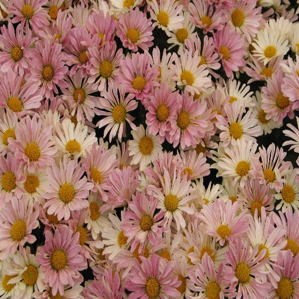 | 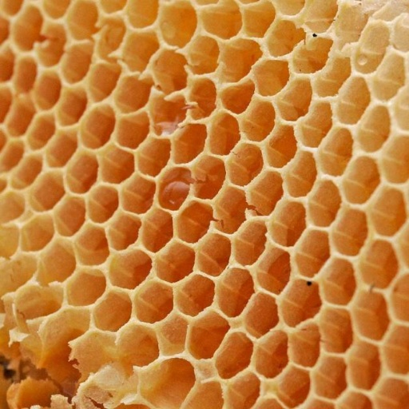 | 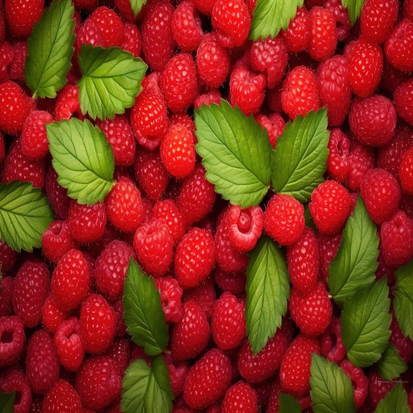 |
| **Seamless Texture** | 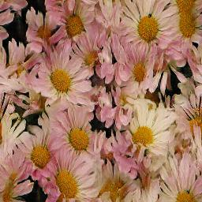 | 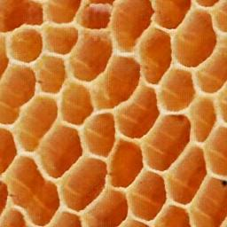 | 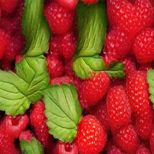 |
| **Tilled Texture**   | 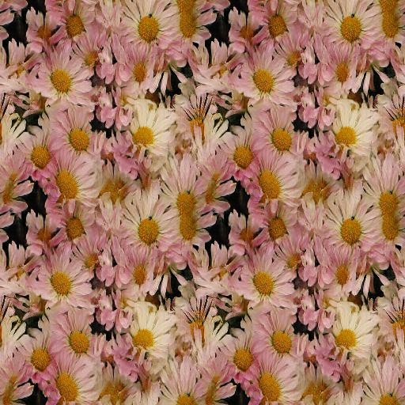 | 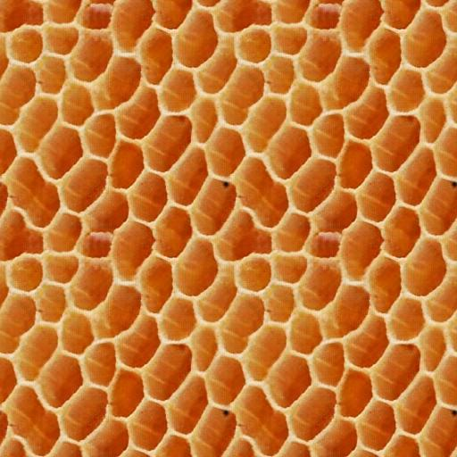 | 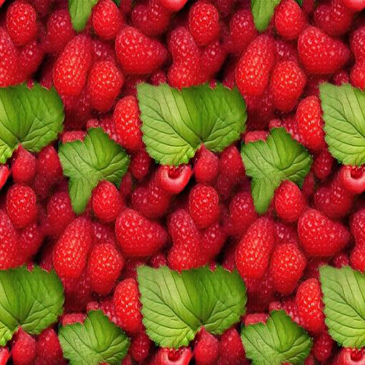 |

|              | <center>chequered_0199</center> | <center>dotted_0190</center> | <center>zigzagged_0036</center> |
|:------------:|:------------------------------:|:----------------------------:|:------------------------------:|
| **Input**    | 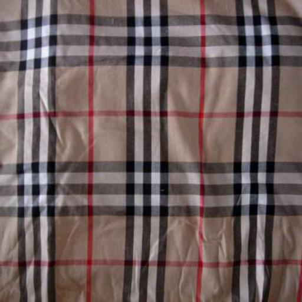 | 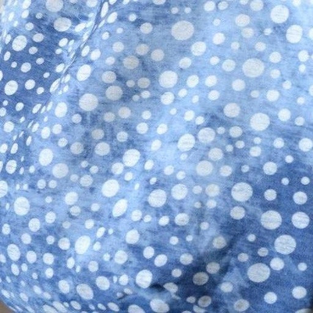 | 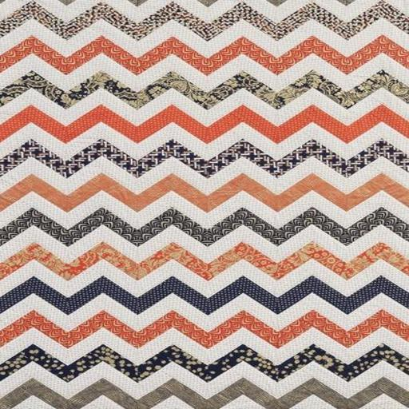 |
| **Seamless Texture** | 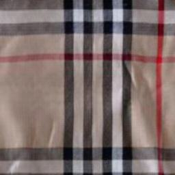 | 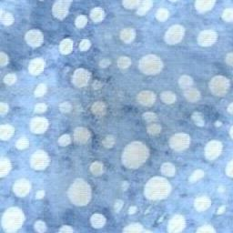 | 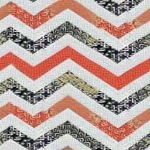 |
| **Tilled Texture**   | 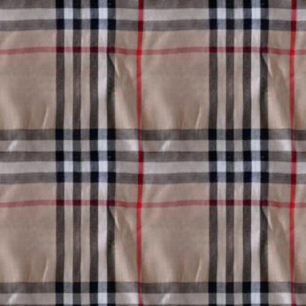 | 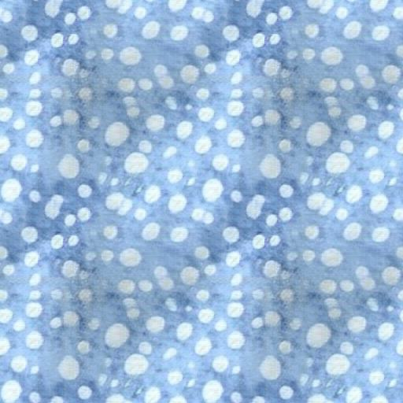 | 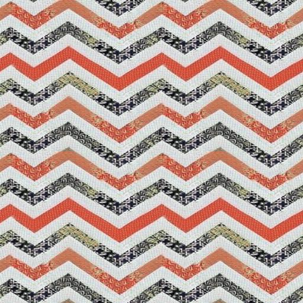 |

|              | <center>banded_0109</center> | <center>banded_0141</center> | <center>banded_0145</center> |
|:------------:|:----------------------------:|:----------------------------:|:----------------------------:|
| **Input**    | 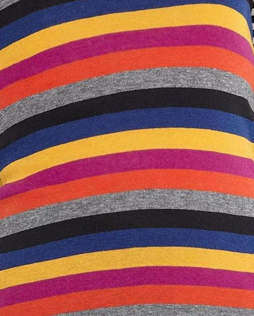 | 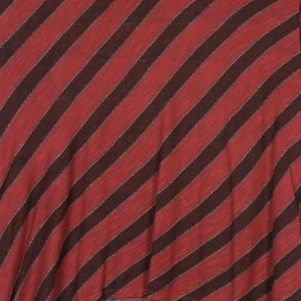 | 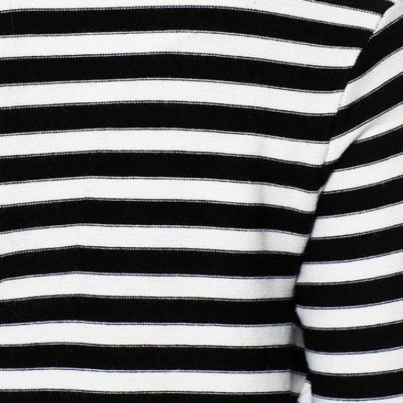 |
| **Seamless Texture** | 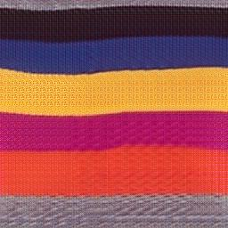 | 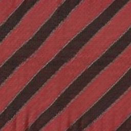 | 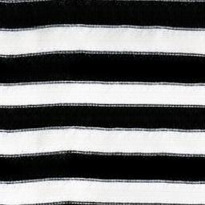 |
| **Tilled Texture**   | 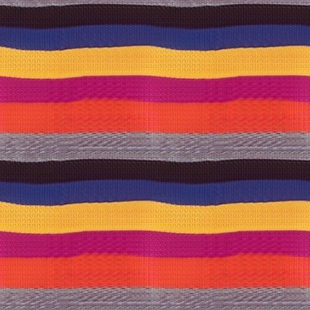 |  | 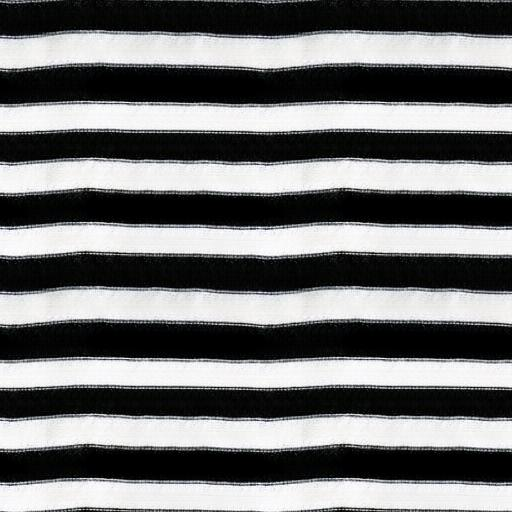 |

# Citation

If this repository is helpful to your research, please cite it as below.

```bibtex
@article{HE2025103866,
title = {TiPGAN: High-quality tileable textures synthesis with intrinsic priors for cloth digitization applications},
journal = {Computer-Aided Design},
volume = {183},
pages = {103866},
year = {2025},
issn = {0010-4485},
doi = {https://doi.org/10.1016/j.cad.2025.103866},
url = {https://www.sciencedirect.com/science/article/pii/S0010448525000284},
author = {Honghong He and Zhengwentai Sun and Jintu Fan and P.Y. Mok},
}

```
